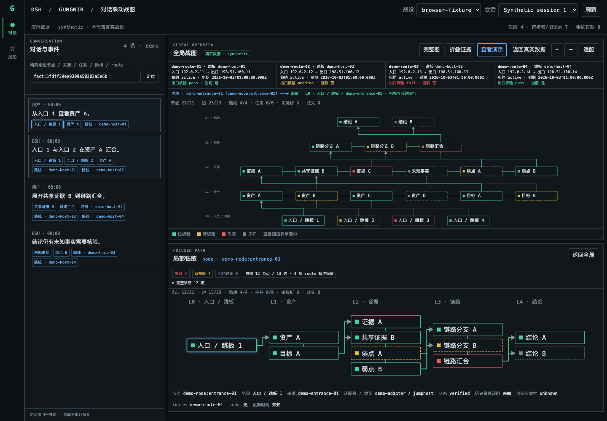
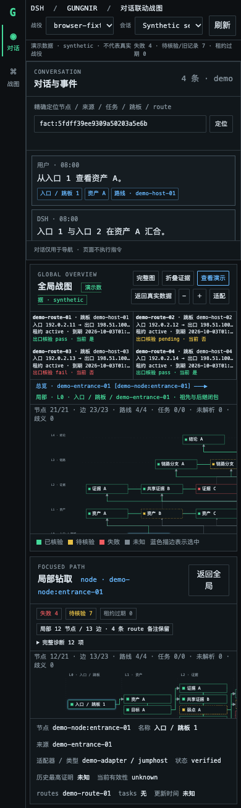
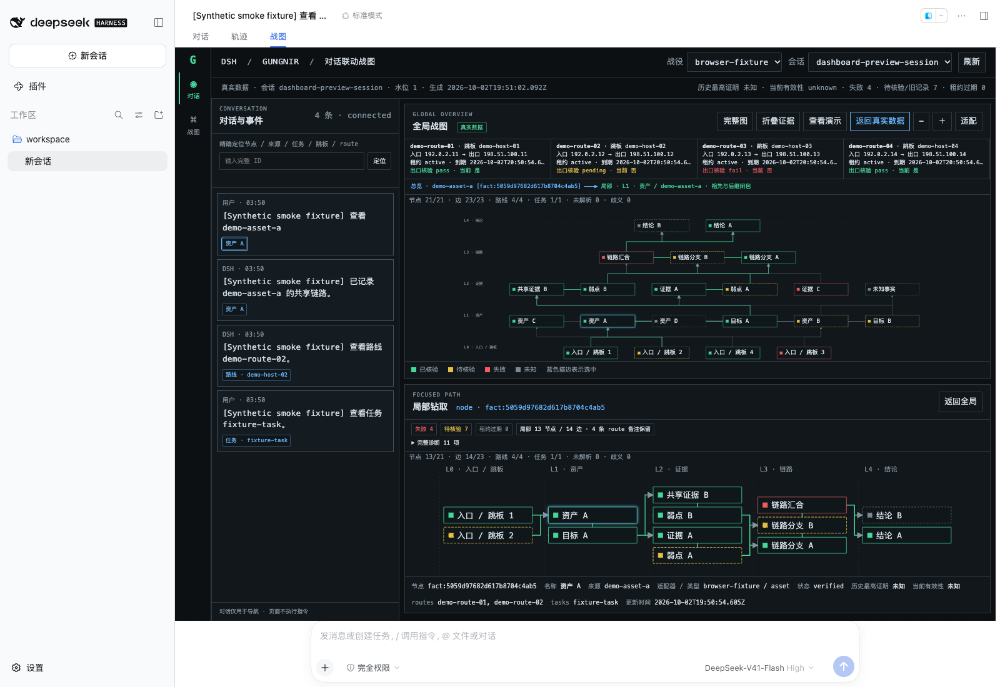

# 对话战图验收记录

日期：2026-10-03。数据为可清理的合成夹具，浏览器使用独立 Chrome context；真实 DSH 运行验证采用独立临时 DSH_HOME、工作区与随机 loopback 端口。未向模型发送 prompt，未改动生产配置或会话。

## 自动化与浏览器

Dashboard 定向套件 32/32，通过真实临时 SQLite、错误/秘密边界、图结构、桥接协议和 Host/Client 契约回归。六道门禁通过；完整测试计数 486，其中通过 480、受环境条件保护的检查跳过 6、失败 0。

[本地浏览器结果](evidence/browser-result.json)通过实际 HTTP→SQLite→SVG 链路：21 节点/23 边/4 条跳板路线、显式会话选择、对话双向定位、route/task 引用、键盘 Enter/Space、刷新焦点保留、共享跳板候选、折叠/缩放/拖动/适配、长标签与恶意文本、部分图诊断、真实读取失败后的旧图清空。另以 261 节点 SQLite 验证孤立证据、全部连线和折叠后的精确搜索。桌面 1440×1000，窄屏 390×844；无横向页面溢出，零 page errors。两库读取前后 SHA-256 不变。

[实际 DSH 结果](evidence/native-result.json)使用当前安装的官方 DSH 0.2.0-rc.2：按 Loader manifest 加载 Node/Client 两端，从 conversation.view 的“战图”页签进入；官方 Session.append/flush 只写临时合成日志，inspect/page 冷读得到 4 条正文，与 21 节点战图联动。官方 cookie 登录跳转到干净 URL；匿名 RPC 返回 401；已登录的跨 engagement 和可见但未绑定的 session 返回 E_DASHBOARD_SCOPE。浏览器验证 opaque iframe 无法读取 parent DOM，原生静态资源 CSP 为 connect-src none。零 page errors，两库哈希不变，宿主与夹具均已关闭/清理。这不代表生产宿主或真实战斗数据已验收。

## 复现

运行时 Node >=22.13；浏览器 smoke 另需可加载的 Playwright 和 Chrome。可通过 PLAYWRIGHT_MODULE_ROOT 指向含 Playwright 的 node_modules 上级目录，或使用本地可解析的 Playwright。脚本不会安装运行依赖或修改运行中的 Host。

```sh
npm run test:dashboard
node scripts/ci.mjs --quiet
node scripts/dashboard-browser-smoke.mjs --output-dir /tmp/gungnir-browser-proof
node scripts/dashboard-native-smoke.mjs --install-anchor /absolute/path/to/@deepseek-ai/dsh/package.json --output-dir /tmp/gungnir-native-proof
```

native smoke 通过给定官方 CLI 安装入口启动临时 web profile；仅对该临时 HOME 完成首次使用提示和“稍后配置”，不会配置模型密钥。JSON 结果和截图写入指定输出目录，不记录认证 URL、cookie 或启动 token。

## 实际截图

独立浏览器展示显式演示数据：



窄屏上下堆叠、图内浏览：



实际 DSH 原生页签，内容为临时合成数据库和会话日志：


